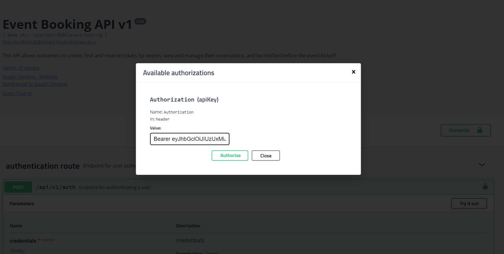

# Event Booking API


## Overview

The Event Booking API is a comprehensive and robust API built using the Java Spring Boot framework.
It facilitates the management and participation in events, providing a seamless experience for both administrators and
general users.
The API supports various user roles and functionalities, ensuring secure and user-friendly operations.

NB: This API is just a proof of concept, hence, H2 in-memory storage was used.

As you examine the API, be sure to make recommendation or report any issue to the contact listed below.

## Assumption

- Desktop Dockers is installed on the host machine
- Docker-compose is installed

## Table of Contents

- [Event Booking API](#event-booking-api)
    - [Overview](#overview)
    - [Assumption](#assumption)
    - [Table of Contents](#table-of-contents)
    - [General Information](#general-information)
    - [Technologies Used](#technologies-used)
    - [Setup](#setup)
        - [Docker Setup](#docker-setup)
        - [Deploy in Kubernetes](#deploy-application-in-kubernetes)
        - [Swagger Endpoint Access](#swagger-endpoint-access)
        - [Access the H2 Console](#access-the-h2-console)
    - [Project Structure](#project-structure)
        - [Config](#config)
        - [DTO](#dto)
        - [Enums](#enums)
        - [Exception](#exception)
        - [Model](#model)
        - [Notification](#notification)
        - [Repository](#repository)
        - [Route](#route)
        - [Security](#security)
        - [Service](#service)
        - [Utils](#util)
    - [Usage](#usage)
    - [Endpoints](#endpoints)
        - [Signup Route](#signup-route)
        - [Sign In Route](#sign-in-route)
        - [Authentication Route](#authentication-route)
        - [Event Management Route](#event-management-route)
        - [Event Reservation Route](#event-reservation-route)
        - [User Management Route](#user-management-route)
        - [Profile Route](#profile-route)
        - [Roles and Permissions Route](#roles-and-permissions-route)
    - [Testing](#testing)
    - [Contributor](#contributor)

## General Information

This API captures the basic functionalities of and event booking system including the following:

* Account creation.
* Account verification via OTP.
* Sign in and authorization.
* Event creation.
* Event ticket reservation.
* Event management.
* Event Notification.
* Profile and account management.
* User management.
* Roles and permissions management.

## Technologies Used

* Language and Frameworks
    * Java Programming Language
    * Java 17
    * Spring Boot 2.7.5
* Dependencies
    * spring-boot-starter-web
    * spring-boot-starter-data-jpa
    * h2
    * spring-boot-starter-security
    * lombok
    * spring-boot-starter-test
    * spring-boot-starter-validation
    * hibernate-types-52
    * commons-validator
    * spring-boot-starter-freemarker
    * spring-boot-starter-mail
    * springfox-swagger2
    * springfox-swagger-ui
    * jjwt
    * spring-boot-starter-oauth2-resource-server
    * flyway-core
    * spring-kafka
    * jackson-databind
    * gson
    * spring-boot-devtools
    * junit-jupiter-engine
    * mockito-core
* Development Tools/IDE
    * IntelliJ IDEA
* Testing
    * Mockito
    * JUnit5

## Setup

Unzip the event-booking.zip file to any directory of your choice, then change to the extracted directory.

### Docker Setup

As mentioned, it is assumed that Docker Desktop is installed on the host machine. The event-booking.zip file contains
the necessary docker files needed to pull kafka and zookeeper docker images used as message/notification broker.
It also contains the Dockerfile and docker-compose files that builds the API and deploys it to Docker Desktop with the
designated port number (8080) and features as directed.

In addition, there are two files called run.sh and run.bat that handles the entire deployment process based on your OS
type.

To run the application:

* Ensure Docker Desktop is running
* Ensure you are able to login to Docker environment
* Replace the email property values with yours. Open the application-dev.yml and application-prod.yml files and update
  the mail properties

```
spring:
  mail:
    username: <ReplaceWithYourEmail>
    password: <ReplaceWithYourEmailAccessToken>
app:
  mail:
    sender:
      email: <ReplaceWithYourEmail>
```

* On Terminal/Command prompt, change to the event-booking directory

```
cd event-booking
```

On Windows

```
execute run.bat
```

on Linux or Apple

```
execute run.sh
```

Please note that the above run file will build the API and deploy it as container in Docker. The application should
start in about 2 minutes.

### Deploy Application in Kubernetes

To deploy the application in Kubernetes with replicas, run the commands:

* Ensure Docker Desktop is running
* Ensure you are able to login to Docker environment
* Ensure you have enabled kubernetes on your docker desktop
* Replace the email property values with yours. Open the application-dev.yml and application-prod.yml files and update
  the mail properties

```
spring:
  mail:
    username: <ReplaceWithYourEmail>
    password: <ReplaceWithYourEmailAccessToken>
app:
  mail:
    sender:
      email: <ReplaceWithYourEmail>
```

* On Terminal/Command prompt, change to the event-booking directory

```
cd event-booking
```

Execute the commands step by step

```
Step 1: Create the docker network and shutdown or stop any previous services/containers then create new ones:

docker network create --driver bridge event_b_network
docker-compose -f src/main/docker/services.yml down
docker-compose -f src/main/docker/services.yml up -d --build


Step 2: Containerize the Spring Boot Application

docker build -t event-booking-img-v1 .
docker images


Step 3: Push the Docker Image to a Container Registry

docker tag event-booking-img-v1  <ReplaceWithYourRegistryURL>/event-booking-img-v1
docker login -u <ReplaceWithYourDockerHubUsername>
>>>At the password prompt, enter the personal access token.
docker push  <ReplaceWithYourRegistryURL>/event-booking-img-v1

Update the file event-booking-deployment.yaml and replace the <ReplaceWithYourRegistryURL> with your actual registry URL

Step 4: Create a Kubernetes Deployment

kubectl apply -f event-booking-deployment.yaml
kubectl get deployments


Step 5: Create a Kubernetes Service

kubectl apply -f event-booking-service.yaml
kubectl get services


Step 6: To check the list of Pods for your service/app:

kubectl get pods --selector=app=event-booking-app

Step 7: To Check the logs:

kubectl logs -f <Pod Name or Id>
Eg.: kubectl logs -f event-booking-rocket-001-844c4fc597-sf4tj 


Step 8: Test the Application

Swagger URL when deployed in Kubernetes:
http://localhost:30086/event-booking/swagger-ui.html

H2 DB URL when deployed in Kubernetes:
http://localhost:30086/event-booking/h2-console/
* JDBC URL: jdbc:h2:mem:event_booking_store;DB_CLOSE_DELAY=-1;DB_CLOSE_ON_EXIT=FALSE
* User Name: sa
* Password: password

If everything was configured correctly, you should see your Spring Boot application running.

```

### Swagger Endpoint Access

The base URL is http://localhost:8080/event-booking/

To access the application endpoints after running,
visit: http://localhost:8080/event-booking/swagger-ui.html
If deployed in Kubernetes, visit: http://localhost:30086/event-booking/swagger-ui.html

As directed, the port number of the API is: 8080, and the context path added is: "/event-booking"

### Access the H2 Console

To access the H2 in memory database, open your browser and visit: http://localhost:8080/event-booking/h2-console/
If deployed in Kubernetes, visit: http://localhost:30086/event-booking/h2-console/

* JDBC URL: jdbc:h2:mem:event_booking_store;DB_CLOSE_DELAY=-1;DB_CLOSE_ON_EXIT=FALSE
* User Name: sa
* Password: password

## Project Structure

The API structure has the following packages under the root package(com.event.booking)

### Config

This is the package that contain all the configuration of the API such as Swagger, CORS, AsyncExecutor, Kafka and
TypeAdapter.

### Dto

This is the package that contain all models for data transfer objects for both requests and responses.

### Enums

This is where enumeration used in the project are located, like the Category and UserType etc.

### Exception

This contains all the customized exceptions used in the application such as BadRequestException, UnauthorizedException,
RecordNotFoundException etc.

### Model

This contains classes all entities of the database such as Event, UsersTable, Role etc.

### Notification

This contains the classes that handles email notification including the Kafka message producer, consumer and java mail
implementation that sends the email to the user. This would have been in a separate module or microservice but due to
time constrain, I included it here.

### Repository

This contains classes that are used for performing database CRUD operations.

### Route

This contains the controller for signup, sign in, authentication, event management, event reservation, roles and
permission, user management and profile.

### Security

This contains classes for the entire security of the application, including generating and validating bearer token,
controlling role and permission access etc.

### Service

This contains the interfaces and service implementation classes for the Signup, Sign in, Event Management, Event
Reservation, Authentication etc.

### Util

This contains classes that hold the response messages, endpoint paths, DTO Mapper and other static objects.

## Endpoints

There are eight different routes to the API: Signup, Sign in, Authentication, Event Management, Event Reservation, User
Management, User Profile and, Roles and Permissions.
> ⚠️ After creating a new account, an OTP is sent to the registered email for verification and account activation.
> Without verifying the email via OTP, the user will not have access to the account.

### Signup Route

| Description                                                         | Method | Endpoint                            |       
|---------------------------------------------------------------------|--------|-------------------------------------|
| Endpoint for creating new user account                              | POST   | /api/v1/users/onboarding/signup     | 
| Endpoint for verifying account email via otp                        | POST   | /api/v1/users/onboarding/verify/otp | 
| Endpoint for sending or resending signup otp for email verification | POST   | /api/v1/users/onboarding/send/otp   | 


### Sign in Route

| Description               | Method | Endpoint                      |       
|---------------------------|--------|-------------------------------|
| Endpoint for user sign in | POST   | /api/v1/users/entrance/signin | 


### Authentication Route

| Description                        | Method | Endpoint     |       
|------------------------------------|--------|--------------|
| Endpoint for authenticating a user | POST   | /api/v1/auth | 


After successful login/authentication, a bearer token is generated, copy the token a paste it in the value field of the
Available authorizations dialog as displayed below:

> ⚠️ The bearer token should be preceded by the word 'Bearer' as in the picture below. Eg. Bearer
> eyJhbGciOiJIUzUxM........




### Event Management Route

| Description                                                                         | Method | Endpoint                               |       
|-------------------------------------------------------------------------------------|--------|----------------------------------------|
| Endpoint for creating new event                                                     | POST   | /api/v1/events                         | 
| Endpoint for updating event                                                         | PUT    | /api/v1/events                         | 
| Endpoint for deleting event                                                         | DELETE | /api/v1/events/{eventId}               | 
| Endpoint for viewing all events reservations                                        | GET    | /api/v1/events/all/reservations        | 
| Endpoint for filtering event reservations by category                               | GET    | /api/v1/events/all/reservations/filter | 
| Endpoint for sending event reminder to all users that reserve a ticket for an event | POST   | /api/v1/events/send-reminder           | 

> ⚠️ Note: When creating or updating an event, eventDate is in the format: YYYY-MM-dd hh:mm:ss. Eg.: 2024-09-25 10:30:00


### Event Reservation Route

| Description                                                   | Method | Endpoint                                          |       
|---------------------------------------------------------------|--------|---------------------------------------------------|
| Endpoint for fetching all events                              | GET    | /api/v1/events                                    | 
| Endpoint for reserving a ticket for an event                  | POST   | /api/v1/events/{eventId}/tickets                  | 
| Endpoint for filtering events by category                     | GET    | /api/v1/events/filter                             | 
| Endpoint for viewing all reservations/booked events by a user | GET    | /api/v1/events/my-reservations                    | 
| Endpoint for deleting or cancelling a reservation             | DELETE | /api/v1/events/reservation/{reservationNo}/cancel | 
| Endpoint for filtering all events by date range               | GET    | /api/v1/events/search/date-range                  | 
| Endpoint for searching events by name                         | GET    | /api/v1/events/search/name                        | 


### User Management Route

| Description                                              | Method | Endpoint                               |       
|----------------------------------------------------------|--------|----------------------------------------|
| Endpoint for deleting a user by uuid                     | DELETE | /api/v1/users/management/delete/{uuid} | 
| Endpoint for filtering users                             | GET    | /api/v1/users/management/filter        | 
| Endpoint for fetching all users                          | GET    | /api/v1/users/management/find-all      | 
| Endpoint for searching users by name, email or user type | GET    | /api/v1/users/management/search        | 


### Profile Route

| Description                             | Method | Endpoint                              |       
|-----------------------------------------|--------|---------------------------------------|
| Endpoint for fetching user profile info | GET    | /api/v1/users/profile                 | 
| Endpoint for signing out                | POST   | /api/v1/users/profile/signout         | 
| Endpoint for updating user profile info | PUT    | /api/v1/users/profile/update          | 
| Endpoint for updating password          | PUT    | /api/v1/users/profile/update-password | 


### Roles and Permissions Route

| Description                                           | Method | Endpoint                  |       
|-------------------------------------------------------|--------|---------------------------|
| Endpoint for viewing all roles                        | GET    | /api/v1/roles             | 
| Endpoint for adding new custom role                   | POST   | /api/v1/roles             | 
| Endpoint for updating existing role via the role uuid | PUT    | /api/v1/roles             | 
| Endpoint for viewing role by uuid                     | GET    | /api/v1/roles/{uuid}      | 
| Endpoint for viewing list of permissions              | GET    | /api/v1/roles/permissions | 


## Testing

Unit testing of the major aspects of the API like Event Management and Event Reservation was done, the other services
were left out due to time constrain.

Test done on this API:

* Unit Testing

Unit Testing Tools:

* Mockito
* JUnit5

## Contributor

| Name         | Email                                       | Contact         | Github                                   |
|--------------|---------------------------------------------|-----------------|------------------------------------------|
| Isaiah Omame | omameazy@gmail.com,<br/> omameazy@yahoo.com | +234 7060812940 | [github](https://github.com/OmameIsaiah) |


